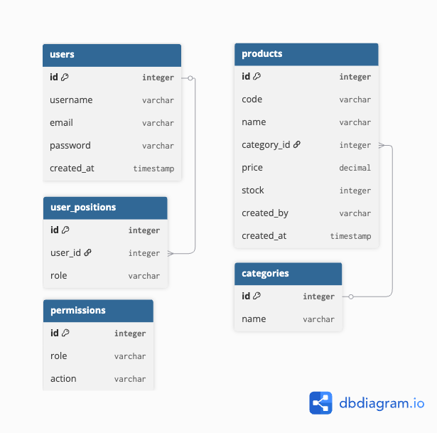

# Interview Question 6 — Product Management System

A full-stack product management system built with ASP.NET Core, Vue.js, and PostgreSQL.

## 🚀 Live Demo
- **Frontend**: https://interview-question-6.vercel.app
- **Backend API**: https://interview-question-6-production.up.railway.app

---

## 🛠 Tech Stack

| Layer | Technology |
|-------|-----------|
| Frontend | Vue 3, Vue Router, Pinia, Axios |
| Backend | ASP.NET Core 10, Entity Framework Core |
| Database | PostgreSQL 16 |
| Barcode | JsBarcode (Code 39 Standard) |
| Deploy (Frontend) | Vercel |
| Deploy (Backend) | Railway |
| Deploy (Database) | Railway PostgreSQL |

---

## ✅ Features

- **Product List** — แสดงรายการสินค้าแบบ pagination 25 รายการต่อหน้า
- **Add Product** — เพิ่มสินค้าด้วยรหัส 16 หลัก format `xxxx-xxxx-xxxx-xxxx` (A-Z, 0-9 เท่านั้น)
- **Delete Product** — ลบสินค้าพร้อม confirm dialog
- **Barcode Display** — แสดง barcode มาตรฐาน Code 39 อัตโนมัติ
- **Seed Data** — ข้อมูลตัวอย่าง 100 รายการจากสินค้า ThaiBev
- **Category** — จัดกลุ่มสินค้าตาม category

---

## 🗄 Database Schema



---

## 🏃 How to Run Locally

### Prerequisites
- .NET 10 SDK
- Node.js 18+
- Docker

### 1. Clone the repository
```bash
git clone https://github.com/yourusername/interview-question-6.git
cd interview-question-6
```

### 2. Start Database
```bash
docker-compose up -d
```

### 3. Run Backend
```bash
cd ProductApi
dotnet restore
dotnet ef database update
dotnet run
```
API จะ run ที่ `http://localhost:5100`

### 4. Run Frontend
```bash
cd frontend
npm install
npm run dev
```
Frontend จะ run ที่ `http://localhost:5173`

---

## 📖 API Documentation

Swagger UI พร้อมใช้งานที่ `http://localhost:5100/openapi/v1.json`

### Endpoints

| Method | Endpoint | Description |
|--------|----------|-------------|
| GET | `/api/products?page=1&pageSize=25` | ดึงรายการสินค้า (pagination) |
| GET | `/api/products/{id}` | ดึงสินค้าตาม ID |
| POST | `/api/products` | เพิ่มสินค้าใหม่ |
| PUT | `/api/products/{id}` | แก้ไขสินค้า |
| DELETE | `/api/products/{id}` | ลบสินค้า |

### Response Structure
```json
{
  "status": 200,
  "message": "success",
  "data": {
    "items": [],
    "pagination": {
      "total": 100,
      "page": 1,
      "pageSize": 25,
      "totalPages": 4
    }
  }
}
```

---

## 📋 Product Code Validation

- ตัวอักษรภาษาอังกฤษพิมพ์ใหญ่ (A-Z) และตัวเลข (0-9) เท่านั้น
- ความยาว 16 หลัก
- Format: `xxxx-xxxx-xxxx-xxxx`
- ตัวอย่าง: `AB12-CD34-EF56-GH78`

---

## 🔮 Planned Features

- [ ] Authentication & Authorization (JWT)
- [ ] Role-based access (SuperAdmin / Admin)
- [ ] Filter products by user and role
- [ ] Login page